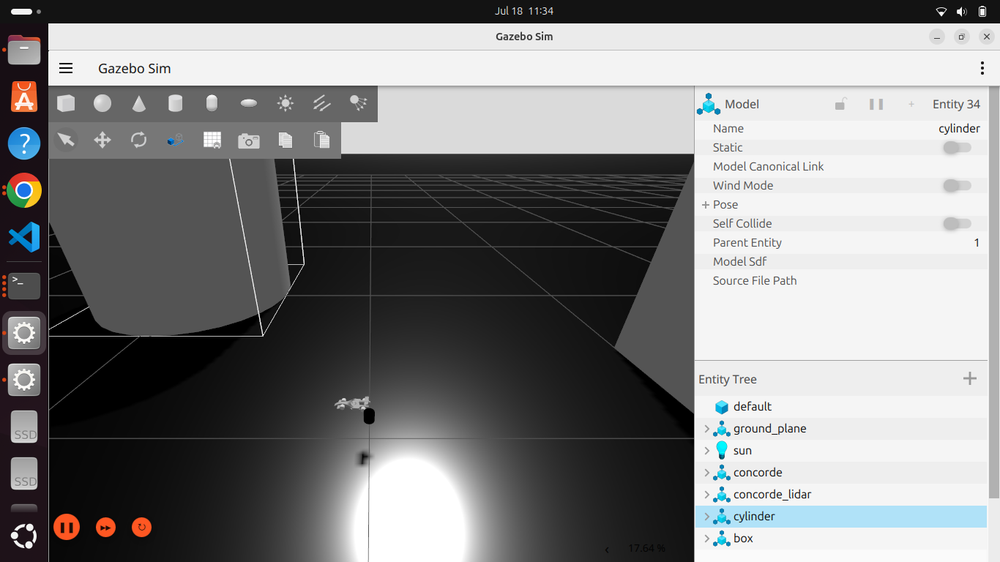

# ros2-jazzy-gazebo-harmonic-cartographer-slam

ROS 2 Jazzy + Gazebo Harmonic differential drive robot with LiDAR-based SLAM mapping using Cartographer. Includes working world SDF, sensor bridge config, and Cartographer Lua — with documented fixes for Gazebo Harmonic sensor, plugin, and TF gotchas.

## Demo

| Gazebo Simulation | SLAM Map in RViz |
|---|---|
|  |  |

---
## Requirements

### System
| Requirement | Version |
|---|---|
| Ubuntu | 24.04 Noble |
| ROS 2 | Jazzy |
| Gazebo | Harmonic (gz-sim8) |
| Python | 3.12 |

### ROS 2 Packages
All required packages can be installed with:
```bash
sudo apt install -y \
  ros-jazzy-ros-gz \
  ros-jazzy-ros-gz-bridge \
  ros-jazzy-ros-gz-sim \
  ros-jazzy-cartographer-ros \
  ros-jazzy-nav2-map-server \
  ros-jazzy-robot-state-publisher \
  ros-jazzy-joint-state-publisher \
  ros-jazzy-tf2-ros \
  ros-jazzy-tf2-tools \
  ros-jazzy-teleop-twist-keyboard \
  ros-jazzy-xacro
```

### Environment Variables
Add these to your `~/.bashrc` — required for Gazebo transport to work correctly on single-machine setups:
```bash
export GZ_IP=127.0.0.1
export GZ_PARTITION=concorde
export ROS_DOMAIN_ID=0
```

---
## Repo Structure

```
concorde/
│
├── README.md
├── package.xml                         # ROS 2 package manifest
├── CMakeLists.txt                      # Build config — installs all folders
│
├── urdf/
│   └── concorde.xacro                  # Robot description with wheel macros,
│                                       # inertia from SolidWorks, VelocityControl plugin
│
├── config/
│   ├── concorde_world.sdf              # Gazebo world — MUST include Sensors system
│                                       # plugin or no sensor produces data
│   ├── lidar.sdf                       # Standalone LiDAR model (gpu_lidar, 360°, 3.5m)
│   ├── concorde_cartographer.lua       # Cartographer SLAM config (2D, no IMU, no odom)
│   └── joint_names_concorde.yaml       # Joint name config from SW export
│
├── launch/
│   ├── gazebo.launch.py                # Launches Gazebo, spawns robot + LiDAR,
│                                       # starts bridge and static TF publishers
│   └── cartographer.launch.py          # Starts Cartographer SLAM + occupancy grid node
│
├── meshes/
│   ├── base_link.STL                   # Robot body mesh (from SolidWorks)
│   ├── link_FL.STL                     # Front left wheel
│   ├── link_FR.STL                     # Front right wheel
│   ├── link_BL.STL                     # Back left wheel
│   └── link_BR.STL                     # Back right wheel
│
├── maps/
│   ├── concorde_map.pgm                # Saved occupancy grid (grayscale image)
│   └── concorde_map.yaml               # Map metadata (resolution, origin, thresholds)
│
└── docs/
    ├── frames.pdf                      # TF tree snapshot from view_frames
    ├── rviz_map.png                    # Screenshot of map in RViz
    ├── gazebo_screenshot.png           # Robot in Gazebo
    └── summary.md                      # Full lessons learned — read this first
```

---

## Quick Start

**Terminal 1 — Launch Gazebo:**
```bash
source install/setup.bash
ros2 launch concorde gazebo.launch.py
```
Wait ~25 seconds for the robot to spawn. Then add obstacles in Gazebo (Insert → Shapes).

**Terminal 2 — Start SLAM:**
```bash
source install/setup.bash
ros2 launch concorde cartographer.launch.py use_sim_time:=true
```

**Terminal 3 — RViz:**
```bash
source install/setup.bash
rviz2
```
Set Fixed Frame → `map`. Add `/map` (OccupancyGrid) and `/scan` (LaserScan).

**Terminal 4 — Drive the robot:**
```bash
source install/setup.bash
ros2 run teleop_twist_keyboard teleop_twist_keyboard \
  --ros-args --remap cmd_vel:=/model/concorde/cmd_vel
```

**Save the map when done:**
```bash
ros2 run nav2_map_server map_saver_cli -f ~/ros2_ws/src/concorde/maps/concorde_map
```

---

## Software Stack

| Component | Package |
|---|---|
| Simulation | Gazebo Harmonic (gz-sim8) |
| SLAM | Cartographer ROS |
| ROS-Gazebo bridge | ros_gz_bridge |
| Visualization | RViz2 |
| Robot description | Xacro |
| Motion plugin | gz::sim::systems::VelocityControl |

---

## Known Limitations

- LiDAR is a separate static model — it does not follow the robot during teleoperation. The map is built from a fixed sensor position.
- Odometry is a static transform placeholder (`odom → base_link`). Real odometry from a DiffDrive plugin is required for Phase 3 Nav2 navigation.
- Gazebo Harmonic requires a custom world SDF — `empty.sdf` does not load the Sensors system plugin and all sensors will silently produce no data.
- `gpu_lidar` requires the `gz-sim-sensors-system` plugin in the world SDF and a rendering engine (ogre2). Without it the sensor registers but publishes nothing.

---

## Lessons Learned

See [`docs/summary.md`](docs/summary.md) for the full breakdown of every issue encountered and how it was resolved. If you are using ROS 2 Jazzy with Gazebo Harmonic, read that file before starting — it will save you days.

---

## License

MIT
